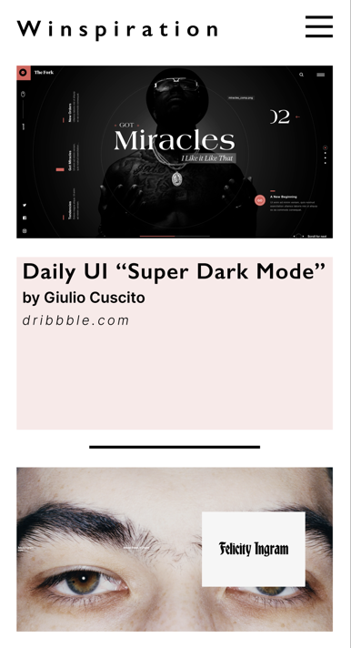

## README - Semester assignment 2 - Inspiration site

### What the project does  
Establish a collection of inspirational sites in this one site.  

### Why the project is useful  
As one of four projects for this term, the goal is to both harvest inspiration, get familiar with norwegian front-end companies and gain prototype- and coding-practice.
	
### How users can get started with the project  
Help yourselves from the files in the [:root folder][] 

### Where users can get help with your project  
Your´re probably best of asking someone on the [World Wide Web](www.google.com).

### Who maintains and contributes to the project  
Contributors:  
* Author: Simon Winter  
	* E-mail: simon-winter@outlook.com
	* Git Hub: [SimonADW](https://github.com/SimonADW)

### Credits  
* For inspiration:  
	* All the linked sites on the page
	* [hoverstat.es](https://www.hoverstat.es/)
	* [Giulio Cuscito](https://dribbble.com/Giulio_Cuscito)

### License  
License is found in the [Lincese.txt](License.txt) in the [:root folder][] 

### Related links
Netlify: [Semesterassignment 2 - Inspiration site](https://frabjous-pithivier-a0f6f5.netlify.app)  
GitHub: [Inspiration site repository](https://github.com/SimonADW/230919-inspiration-site)

MIT © [Simon Winter](https://github.com/SimonADW)  

[:root folder]: ./